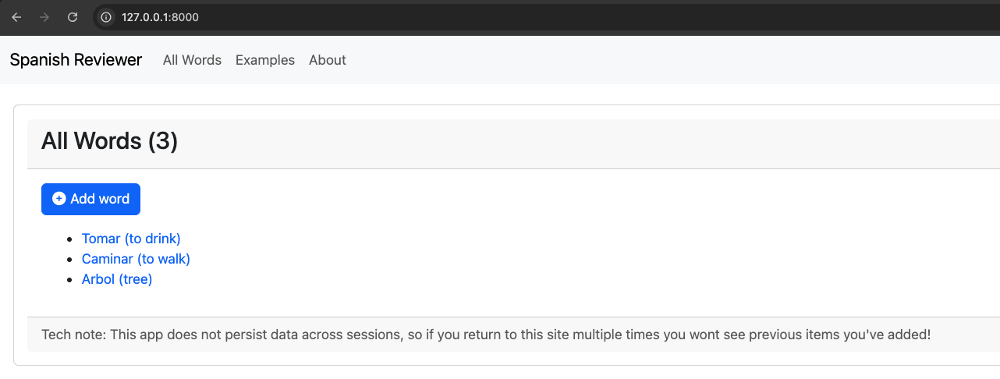
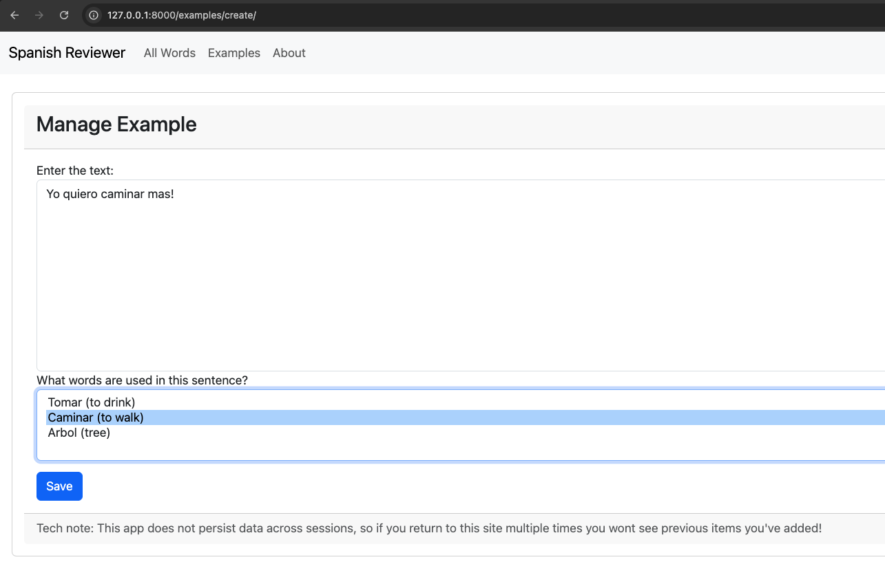

# review-spanish

A django app to help me review spanish words, it's deployed on heroku [here](https://spanish-reviewer-app-1edc2efa484f.herokuapp.com/).

Users can create new words:


And then create example phrases that are linked to those words!


## Quickstart

Set the `DJANGO_SPANISH_REVIEW_SECRET` environment variable on your machine and then run:

```sh
python -m venv .venv
source .venv/bin/activate
python -m pip install -r requirements.txt
python manage.py migrate
python manage.py runserver
```

## Dev notes

This app uses the users session in order to connect items that are created, and to simulate a new session you can just go in to devtools and delete the "" cookie and reload!

```
Application > Storage > Cookies > this site > "sessionid" > Delete
```

To see heroku logs:
```
heroku logs --app <app name>
```