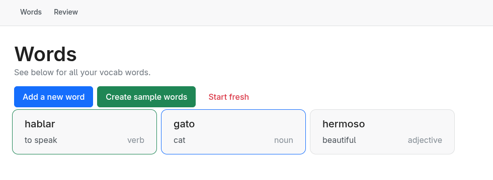
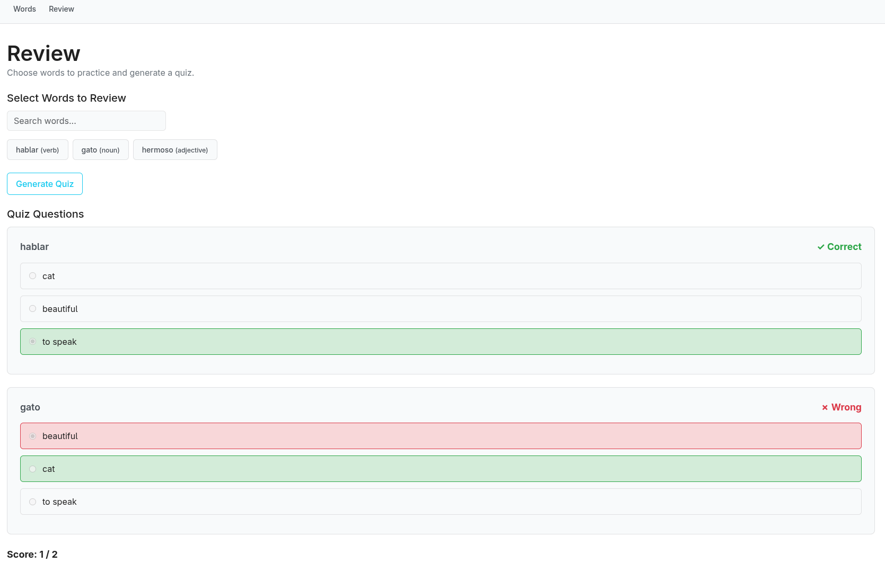

# Spanish Review App

A web application with a frontend in React and a backend in Django to help me review and quiz myself on spanish words. 

- The latest version of the app is deployed [here](https://frontend-production-c74b.up.railway.app/)
- The old version of the app that uses ONLY Django is deployed [here](https://spanish-reviewer-app-1edc2efa484f.herokuapp.com/).

You can create / update / delete words:


And review them by generating a quiz:


## Quickstart

Set the `DJANGO_SPANISH_REVIEW_SECRET` environment variable on your machine and then

start the backend
```sh
cd backend
python -m venv .venv
source .venv/bin/activate
python -m pip install -r requirements.txt
python manage.py migrate
python manage.py runserver
```

and start the frontend:
```sh
cd frontend
npm install
npm run dev
```

## Dev notes

This app doesn't use any sort of authentication, so words are tied to a user's session token and stored in localStorage on the frontend.
